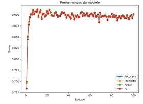
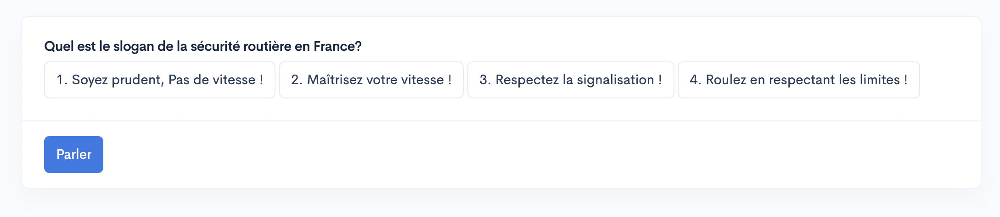
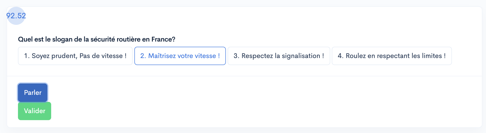
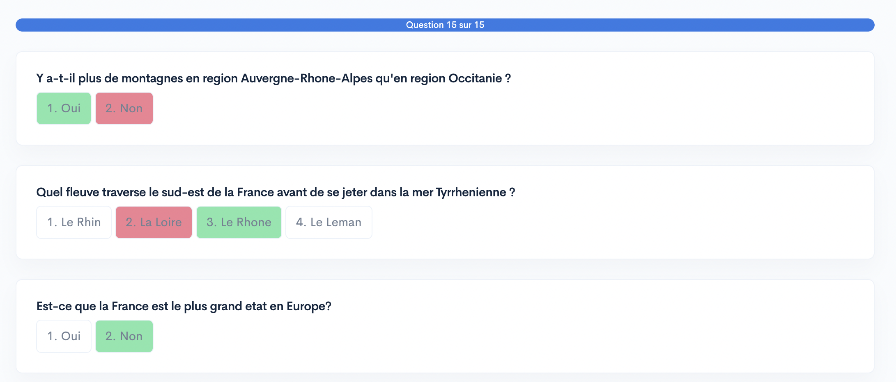
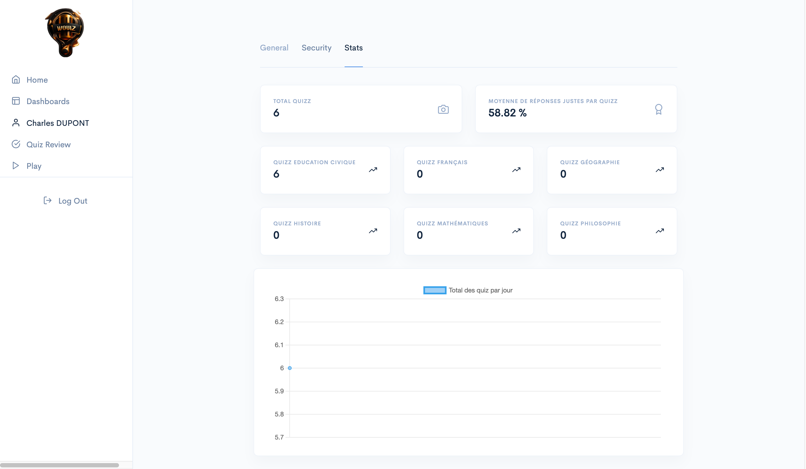
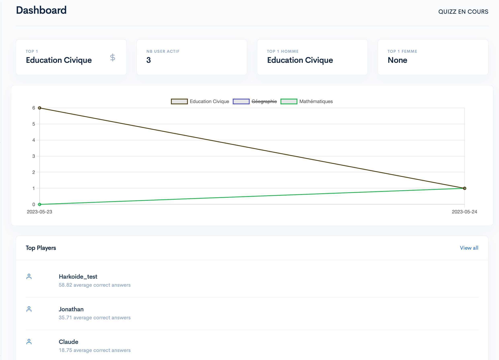
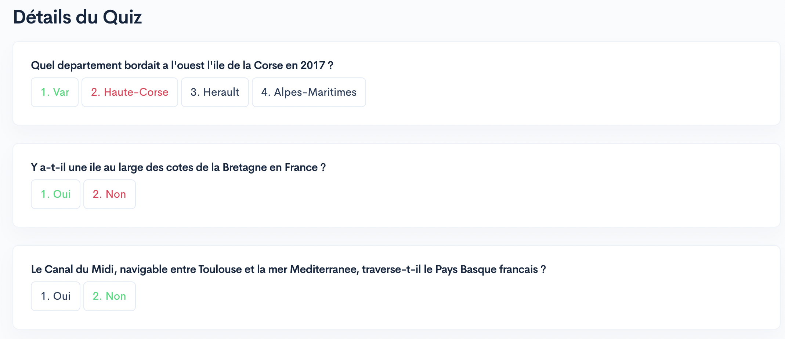

# Wouiz : Ton guide vers la réussite

    

## Rappel du sujet du projet

L'objectif de ce projet est de concevoir un jeu de Quiz interactif multi-utilisateur dans lequel les réponses sont fournies par les utilisateurs à l'aide de la voix.

Pour répondre aux Quizz, les utilisateurs pourront utiliser la reconnaissance vocale pour donner leurs réponses. Ils seront présentés avec une série de
questions et devront répondre en prononçant leur réponse à voix haute. Le système utilisera ensuite la reconnaissance vocale pour convertir leur réponse en texte et
évaluer sa validité.

## Conditions du projet
- Stocker le modèle et le quizz dans le cloud **(Cloud Computing)**
- Entraîner un modèle à reconnaître différentes commandes vocales **(Machine Learning)**
- Proposer une interface du quiz utilisant ce modèle **(Développement Web)**
- Proposer une dataviz présentant les résultats des joueurs.euses **(Datavisualisation)**

## L'équipe
- Syrine : Machine Learning
- Claude : Machine Learning
- Charles : Développement Web
- Jonathan : Développement API / Cloud Computing

## Notre vision du projet

Notre projet consiste à créer une plateforme éducative pour aider les étudiants à réviser et à renforcer leurs compétences dans différentes matières scolaires. Ils pourront suivre leur progression, et interagir avec des enseignants et d'autres étudiants. Notre objectif est de rendre l'apprentissage en ligne facile et innovant. 

## Solutions utilisés
- Cloud Computing : Google Cloud Platform 
- Modèle de machine learning : CNN & LSTM
- API pour interagir avec le modèle : Flask
- Front-End : Django

## Fonctionnalités du projet 
- Possibilité de créer un compte et de se connecter
- Génération quasi illimitée de questions grâce à Text-davinci-003
- Outils de datavisualisation pour suivre son évolution par rapport aux autres participants
-Modèle de machine learning avec une précision de 92% sur les données d'entraînement
- API permettant d'interagir avec le modèle de deep learning

## Fonctionnement & performance du modèle :
 
- Chargement des données audio :
		Les étiquettes correspondant aux données audio sont également extraites et mappées à des entiers pour la classification.
		Chaque fichier audio est chargé à l'aide de la bibliothèque Librosa, puis prétraité pour avoir une durée fixe et un niveau de bruit réduit.
		Les caractéristiques audio, telles que les coefficients MFCC, sont extraites à partir des signaux audio prétraités.
	
- Augmentation des données audio :
		Les données audio peuvent être augmentées pour améliorer la performance du modèle.
		La fonction augment_audio_data est utilisée pour générer des variantes des données audio existantes en modifiant légèrement la vitesse du signal.
		Les données audio augmentées sont enregistrées dans des fichiers pickle pour une utilisation ultérieure.

- Création du modèle CNN-LSTM :
		Le modèle est construit à l'aide de la bibliothèque Keras.
		Il comprend une combinaison de couches convolutives 2D (Conv2D), de couches de pooling (MaxPooling2D), de couches LSTM (LSTM) et de couches entièrement connectées (Dense).
		Le modèle utilise la fonction d'activation ReLU, une couche de dropout pour la régularisation, et une couche de sortie avec une activation softmax pour la classification.

- Entraînement et évaluation du modèle :
		Le modèle est compilé avec l'optimiseur Adam et la perte de catégorisation croisée (categorical_crossentropy) comme fonction de perte.
		Le modèle est ensuite entraîné sur les données d'entraînement pour un nombre d'époques spécifié:
		. À chaque époque, les prédictions du modèle sont comparées aux étiquettes réelles pour calculer plusieurs métriques de performance, telles que l'exactitude (accuracy), la précision (precision), le rappel (recall) et le score F1.

- Performances du modèle :
		Le modèle semble avoir des performances relativement bonnes: Les mesures d'évaluation telles que l'exactitude, la précision, le rappel et le score F1 sont toutes supérieures à 0,89, ce qui indique que le modèle est capable de classifier les données avec une précision raisonnable.
		Au fil des époques, on peut observer une amélioration des performances, notamment une augmentation de l'exactitude, de la précision, du rappel et du score F1. 
		Cependant, il semble y avoir une légère variation des performances d'une époque à l'autre, ce qui suggère que le modèle pourrait bénéficier d'un ajustement supplémentaire pour stabiliser ses performances.

    

## Fonctionnement du site
- URL : https://flask-api-387522.oa.r.appspot.com/
- Le quizz : 
    Cliquez sur le bouton "Parler" puis, parler dans votre microphone et cliquez sur "Arrêter". 
    

        
    

     
    À la fin du traitement par le modèle, la réponse détectée sera sélectionnée en vert et dans le coin supérieur gauche, la précision de la prédiction apparaitra. Si vous n'êtes pas d'accord avec la réponse sélectionnée, vous pouvez cliquer sur la réponse que vous pensez juste et appuyer sur le bouton "Valider".

    

        
    

    Une fois toutes les questions réalisées, une page affichera toutes les questions auxquelles vous avez répondu ainsi que vos réponses et les bonnes réponses en cas d'erreur.
    

        
    

- La datavisualisation

Chaque utilisateur a la possibilité d'accéder à ses statistiques personnelles : 

    

Les utilisateurs peuvent également visualiser diverses informations générales concernant le site et les quizz réalisés par tous les utilisateurs.

    

- Historique des quizz
Il vous sera possible de visualisez les quizz que vous avez réalisés.

    

Et ainsi revoir vos différentes questions et réponses.

    

## Pistes d'amélioration

- Améliorer le modèle de génération des questions via l'utilisation de ChatGPT.
- Intégrer un système de vérification (via un réseau de neurones ?) pour éviter la redondance des questions.
- Améliorer le modèle pour le rendre plus robuste.
- Intégrer un système de fine tuning personnalisable pour chaque utilisateur.
- Intégrer la vision professeur sur le site web
